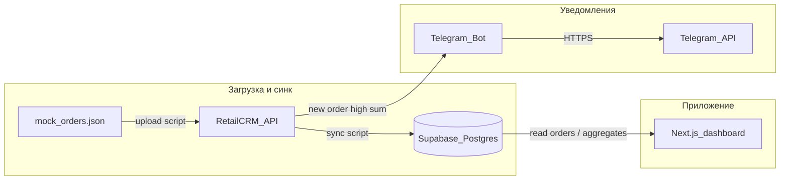

# Архитектура — мини-дашборд заказов

Цель: данные заказов из **RetailCRM** попадают в **Supabase**, **веб-дашборд** читает Supabase и показывает график, **Telegram** получает уведомление при заказе с суммой **> 50 000 ₸**.

## Стек (рекомендуемый)

| Слой | Технология | Зачем |
|------|------------|--------|
| Фронт + API-маршруты | **Next.js** (App Router) | Одна кодовая база, деплой на Vercel, серверные функции для секретов. |
| БД + auth-ready API | **Supabase** (Postgres) | Хранение заказов, Row Level Security при необходимости, REST/JS client. |
| Источник истины по заказам | **RetailCRM** API v5 | Демо-магазин, создание/чтение заказов. |
| Уведомления | **Telegram Bot API** | Отправка сообщений в чат по событию. |
| Одноразовая загрузка + периодический синк | **Node-скрипты** в `scripts/` | Загрузка `mock_orders.json`, синк RetailCRM → Supabase (cron на Vercel или ручной запуск). |

Альтернатива: Python вместо Node для `scripts/` — тогда в репо один `requirements.txt` для скриптов; дашборд всё равно удобнее на Next.js для Vercel.

## Потоки данных

Уточнение по **шагу 5**: RetailCRM не «пушит» в Telegram сам. Варианты реализации:

1. **После синка или при webhook RetailCRM** (если доступен на демо): серверная функция сравнивает сумму и вызывает `sendMessage`.
2. **По расписанию (Vercel Cron)**: запрос к RetailCRM «заказы за последние N минут», фильтр по сумме, дедупликация по `id`, отправка в Telegram.

Для демо чаще выбирают **Cron + опрос API** или проверку **сразу после записи заказа** в скрипте загрузки (если загрузка идёт из вашего кода пачкой — уведомлять по каждому импортированному заказу > порога).

## Модель данных в Supabase (черновик)

Таблица `orders` (имена полей можно уточнить под ответ RetailCRM):

- `id` (uuid, PK) или `retailcrm_id` (text/uuid) как уникальный ключ из CRM
- `external_id` — id заказа в RetailCRM для идемпотентности синка
- `total_kzt` — сумма в тенге (вычислена из позиций)
- `status`, `created_at`, `raw_payload` (jsonb, опционально) — для отладки

Таблица `order_events` (опционально) — лог отправленных уведомлений, чтобы не слать дубли.

## Границы ответственности

- **Сдаётся в GitHub:** приложение, `scripts/` для воспроизводимости, `docs/`, `.env.example`, SQL миграций Supabase (если используете).
- **Не сдаётся:** каталог `local/` и `.cursor/` на вашей машине (не в git) — см. [LOCAL_WORKFLOW.md](./LOCAL_WORKFLOW.md).

## Безопасность

- В браузер попадает только **anon** ключ Supabase и **публичный** URL; доступ к данным ограничить RLS или отдавать агрегаты через **Route Handler** Next.js.
- **Service role** Supabase и ключ RetailCRM — только на сервере (Vercel Environment Variables, локально `.env`).
- Токен Telegram — только сервер.
